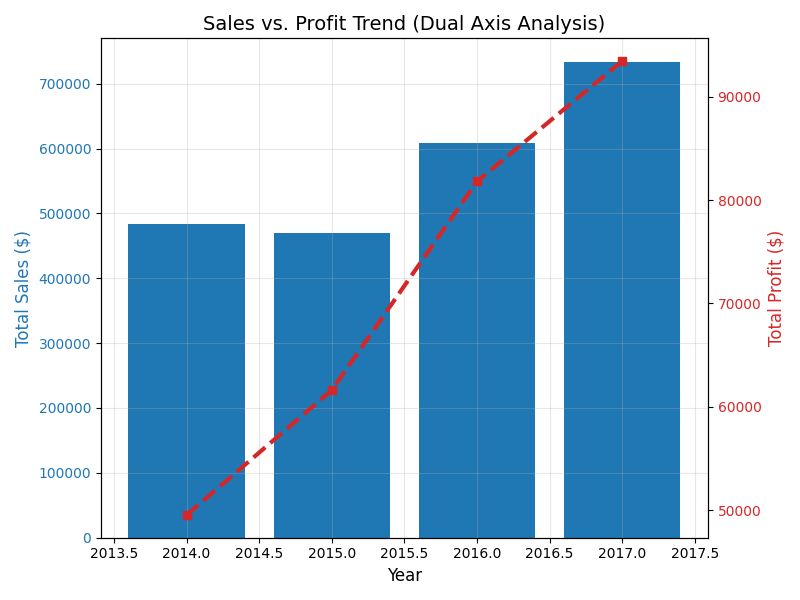
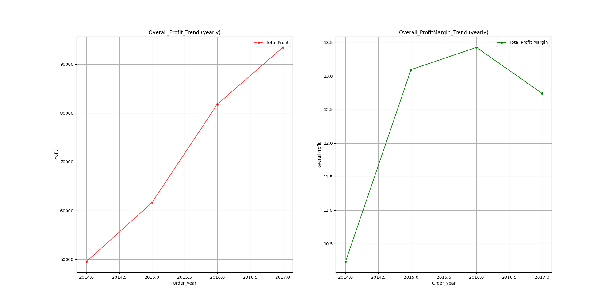
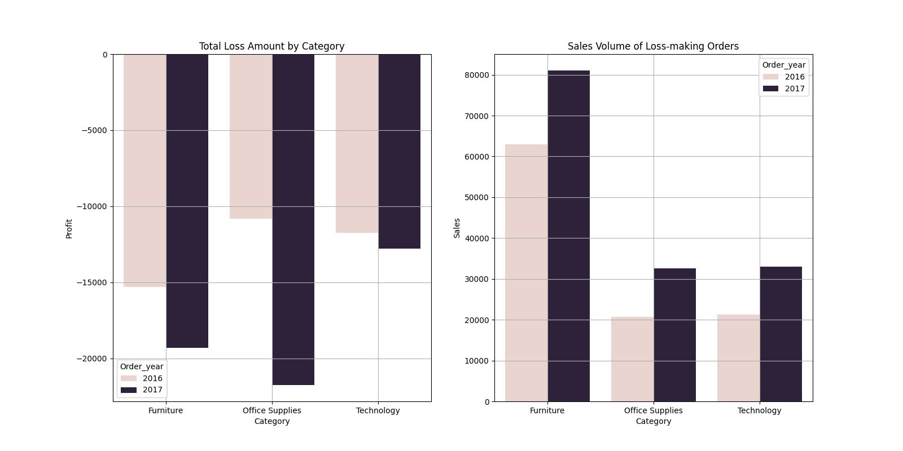
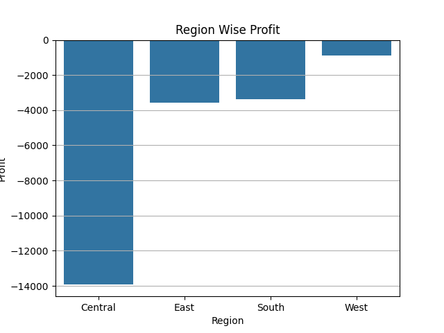
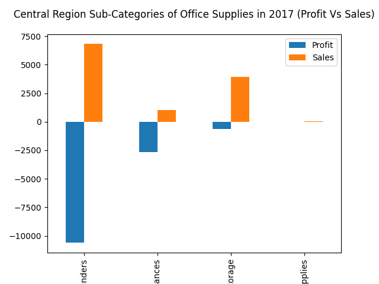
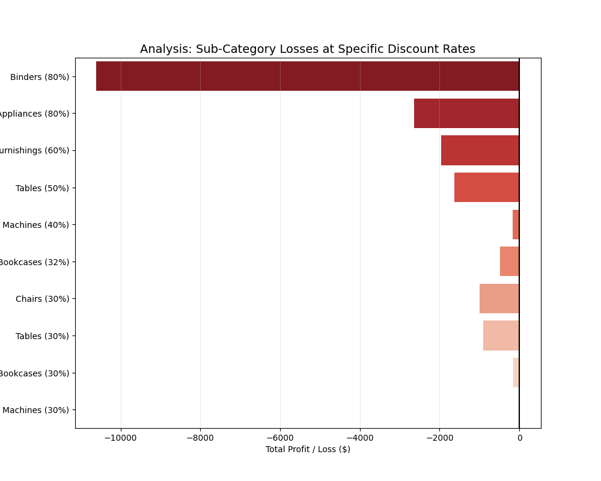
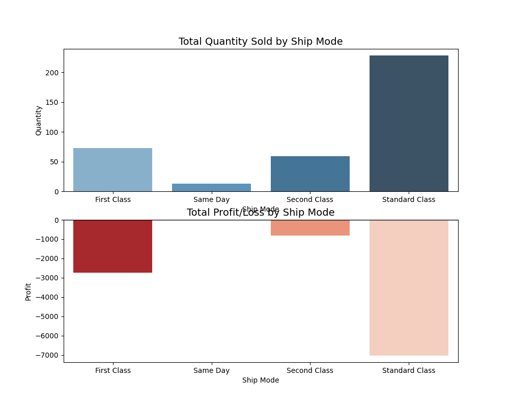
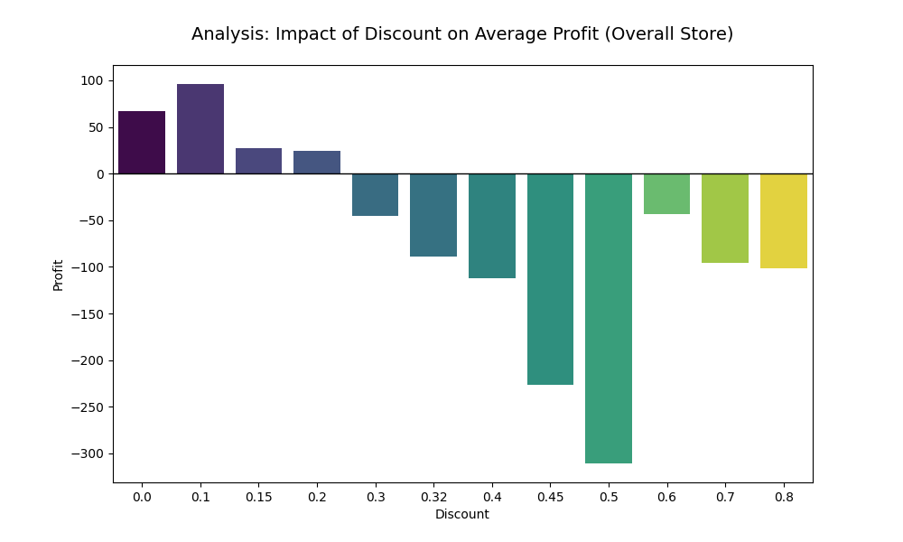

# Superstore Sales & Profitability Analysis

## Project Overview
In this project, I performed a comprehensive data analysis for a retail Superstore using Python. The dataset covers four years of sales and profit data (2014-2017). My goal was to explore the business's growth patterns and evaluate the efficiency of sales operations across different regions and categories

## Problem Statement
While the Superstore saw a significant increase in total sales volume in 2017, the net profit did not grow at a proportional rate.  A visual analysis of the trends indicates that the cost of generating sales is rising, leading to a visible decline in overall profit margins. 
The core objective of this analysis is to investigate this divergence and identify the specific factors, whether regional, categorical, or operational, that are suppressing profitability.

## Methodology:

### Data Collection & Understanding
    - Dataset Size: 9,994 records and 21 features.
    - Time Frame: Data spans from January 2014 to December 2017.
    - Feature Breakdown: The dataset contains Categorical variables (Region, Category, Sub-Category) and Numerical variables (Sales, Profit, Discount, Quantity).
    - Key Metrics: Focused on Sales, Profit, and Discount to identify the drivers of business performance.

### Data Integrity: Performed data cleaning:
    - Handled date formats
    - Standardized category names
    - Identified and removed duplicate records to ensure unique transactions and to prevent overcounting.
    - Verified that there were no missing values in critical columns.

### Exploratory Data Analysis (EDA):

**Sales vs. Profit (The Big Picture)**

Looking at the overall trajectory from 2014 to 2017, there is a clear and healthy growth in our Sales volume. However, the real story lies in the Profit line, which isn't quite keeping pace.
Especially in 2017, we see a significant "divergence"—Sales reached an all-time high, but Profit didn't follow that same upward curve. This is a red flag. It tells us that while our market reach is expanding, our operational efficiency is leaking. We are working harder to sell more, but the bottom line isn't reflecting that effort.

**Sales vs. Profit Margin (The Efficiency)**

If we strip away the big Sales numbers and look at the Profit Margin (%), the picture becomes even clearer. A steady or declining margin in the face of rising sales suggests that our "Cost of Doing Business" is creeping up.
It feels like the business is stuck in a 'growth at any cost' phase. Whether it's rising shipping costs or aggressive seasonal discounting, our ability to retain a percentage of every dollar earned is being squeezed. To fix this, we need to stop looking at how much we sell and start looking at how profitably we sell.
                
**Segmentation:**

To uncover the true health of the business, I isolated all transactions that resulted in a loss during 2016 and 2017. By comparing Sales volume directly against Negative Profit, a startling 'Inverse Relationship' emerged: As our Sales climbed, our losses deepened.
Office Supplies stands out as the primary concern. In just one year, its losses more than doubled—plunging from -$10.8k to -$21.7k—despite maintaining significant sales volume. This confirms that we are dealing with a systemic issue where we are successfully moving products but doing so at a price that doesn't even cover basic costs.
Similarly, Furniture and Technology also show consistent negative margins. The data proves that our growth in these segments is 'artificial.' We are essentially scaling a deficit—the more we sell under current discount structures, the more financial damage we sustain. This points to a desperate need to overhaul our pricing strategy, specifically in the Central Region.

**Region-wise Profit Loss of Office Supplies Sub-Category in 2017:**

After narrowing down the problem to Office Supplies, the next logical step was to identify the Geographical Hotspot. The regional breakdown for 2017 makes it undeniable: the Central Region is where the bleeding is most severe.
While other regions are operating within manageable limits, the Central Region's performance is an outlier. This tells us that the problem isn't necessarily with the product itself, but with how it’s being managed or priced in this specific territory. By identifying this 'Hotspot,' we can now focus our investigation on regional policies rather than blaming the entire national supply chain
        
**Drilling Down (Sub-Category Insights):**

To pinpoint the exact source of the deficit within the Central Region's Office Supplies in 2017, I analyzed the performance at a sub-category level. The data reveals that Binders is the primary driver of the loss, contributing a massive -$10.6k in negative profit. A critical observation here is that the loss generated by Binders significantly exceeds its total sales volume ($6.8k). While Appliances and Storage also show negative trends, Binders is clearly the high-priority area that requires immediate investigation into its operational or strategic factors.
        
**Root Cause:**

To validate the exact cause of profit leakage in 2017, I filtered the data for the Central Region and analyzed the relationship between Sub-Categories and Discount levels. By aggregating the total profit for discounts above 30%, it became evident that Binders at an 80% discount rate were the single largest contributor to the regional loss.
**Highest Loss Contributor:** Binders (80% Discount) is the primary driver of the deficit with a loss of -$10,607, which is higher than its total sales value.
**Loss vs. Sales Paradox:** For Binders and Appliances at an 80% discount, the negative profit is significantly larger than the revenue generated, indicating a total pricing failure.
**The 30% Threshold:** Most sub-categories (Tables, Chairs, Bookcases) consistently move into a deficit as soon as the discount rate hits 30% or higher.
**Performance Anomaly:** Machines is the only sub-category that remains marginally profitable ($8.99) at a 30% discount, while all other categories show a loss at the same level.

**Key Insight:**

While analyzing the 2017 data for the Central Region, I discovered a significant deficit in the 'Office Supplies' category, specifically in 'Binders.' To validate my findings, I investigated if expensive shipping (First Class) was draining our profits.
**Standard Class (Cheapest):** Highest volume (228 units) | Loss: $7,027
**First Class (Premium):** Lower volume (73 units) | Loss: $2,738

The fact that even our cheapest shipping mode is generating significant losses proves that the issue is not the shipping cost. Instead, the 80% discount has reduced the sales price so much that it cannot cover basic expenses. Aggressive discounting is the root cause.

        
**The Big Picture: Overall Impact of Discounts:**

To verify if this was a broader trend, I analyzed the average profit across all discount levels for the entire store. As shown in the chart above, profit remains positive until the 20% threshold, after which any further discounting leads to a sharp decline into negative territory.

